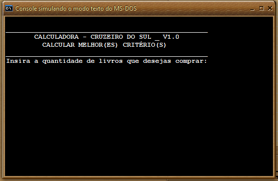
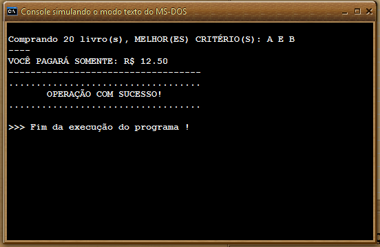

# 📚 Calculadora de Livros

Este projeto consiste em um algoritmo que determina o melhor critério de compra de livros baseado no **menor valor a pagar**.

## 📌 Regras

O cálculo é feito com base em três critérios diferentes:

- **Critério A**: Custo fixo de **R$ 7,50** + desconto de **R$ 0,25** por livro.
- **Critério B**: Custo fixo de **R$ 2,50** + desconto de **R$ 0,50** por livro.
- **Critério C**: Custo fixo de **R$ 1,50** + desconto de **R$ 0,65** por livro.

O valor a pagar é calculado pela fórmula:

Valor Final = Custo Fixo + (Quantidade de Livros \* Desconto)

## 🏆 Exemplos

Abaixo estão alguns exemplos demonstrando qual critério é mais vantajoso:

| Quantidade de Livros | Cálculo A | Cálculo B | Cálculo C | Melhor Critério |
| -------------------- | --------- | --------- | --------- | --------------- |
| 1 Livro              | R$ 7,75   | R$ 3,00   | R$ 2,15   | **C**           |
| 7 Livros             | R$ 9,25   | R$ 6,00   | R$ 6,05   | **B**           |
| 21 Livros            | R$ 12,75  | R$ 13,00  | R$ 15,15  | **A**           |
| 20 Livros            | R$ 12,50  | R$ 12,50  | R$ 14,50  | **A e B**       |

ℹ️ _Em alguns casos, mais de um critério pode ser o melhor._

## 🖥️ Exemplo de Saída

  

  

## 🚀 Tecnologias Utilizadas

- **VisualG** – Para a implementação do algoritmo.

## 🛠️ Como Executar

1. Abra o **VisualG** no seu computador.
2. Carregue o arquivo `.alg` do projeto.

---

📌 **Observação:** Este projeto foi desenvolvido para fins acadêmicos.
